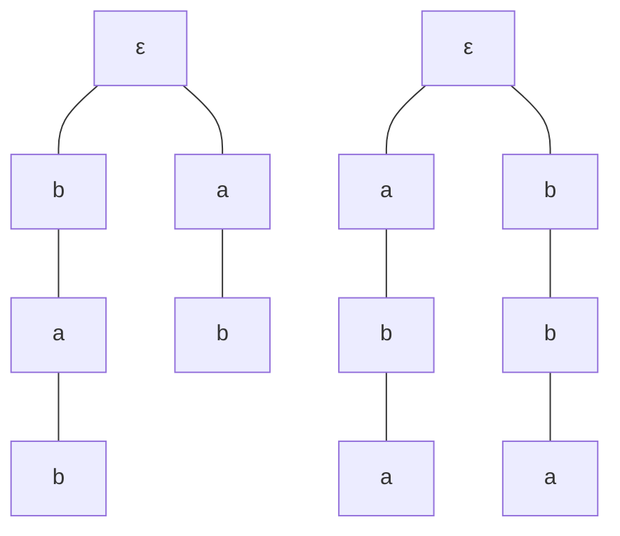

>[!warning]
>Pour ce TD, nous travaillerons avec l'alphabet $\Sigma = \{a, b\}$.

  

    1
    Soient \(X=\{ab, bab\}\) et \(Y=\{aba, bba\}\).
  

  <ol class="exo-questions">
    <li>Représenter \(X\) et \(Y\) sous forme arborescente.</li>
    <li>Calculer \(X \cdot Y\) et \(Y \cdot X\) et donner leur représentation sous forme arborescente.</li>
    <li>Que remarque-on sur les deux représentations précédentes ?</li>
  </ol>

  

